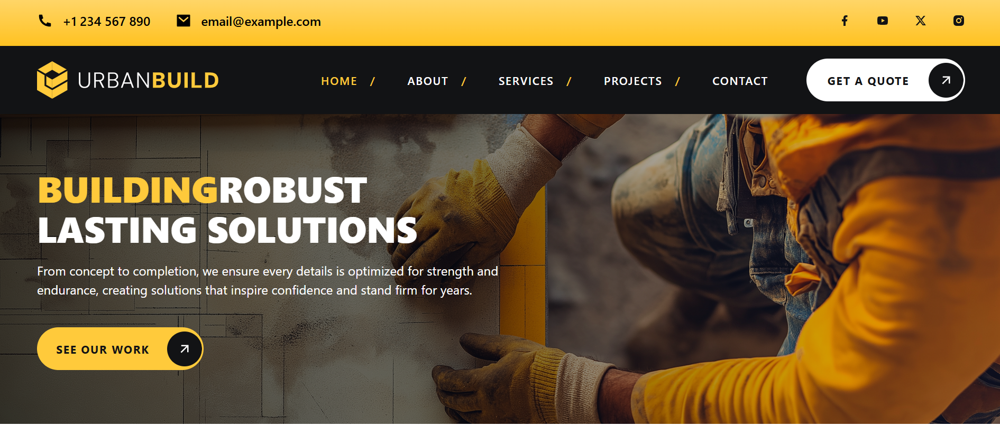

🏗️Construction Website

Modern, fully responsive website for a construction company. Built with Next.js, TailwindCSS, Framer Motion, and Radix UI, focusing on a clean user experience, smooth transitions, and an attractive design across all devices.

🚀 Tech Stack

-Next.js 14 — Fast, SEO-friendly React framework with SSR and SSG.

-React 18 — Powerful component-based UI library.

-TailwindCSS 3.4 — Utility-first CSS for rapid, responsive styling.

-Framer Motion — Modern, smooth animations.

-Radix UI — Accessible UI primitives (Dialog, Select, Tabs).

-Lucide React & React Icons — Beautiful, lightweight icon libraries.

-Swiper — Responsive carousel/slider.

-React CountUp — Animated counters.

-React Scroll — Smooth scrolling navigation.

📦 Installation:

1.Clone the repository:

git clone https://github.com/Steven0319/construction-website.git

2.Install dependencies:

npm install

3.Start the development server:

npm run dev

📱 Responsive Design

Mobile-first design, fully optimized for mobile, tablet, and desktop screens with a modern look, smooth transitions, and excellent usability.

📸 Demo

✨ Features

🔥 Landing page with smooth animations

🖊️ Clean and functional forms

📞 Contact section with detailed icons

🎨 Smooth, consistent transitions

🌐 SEO-optimized with Next.js best practices
